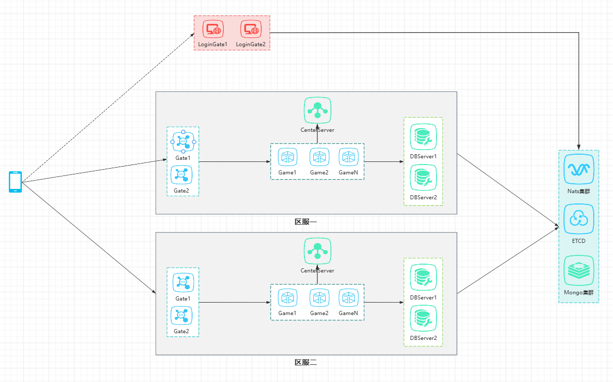

启动步骤：

一、先安装mongodb，工程docker-compose目录下有相关的脚本可以直接运行，或者自行另安装mongodb。

二、数据库表的初始化，如下脚本

```js
use AccDB;
db.RealAreaInfo.insertMany([
	{
		"_id":1,
		"GateList":["127.0.0.1:9001"]
	},
	{
		"_id":2,
		"GateList":["127.0.0.1:9002"]
	}]
);


db.ShowAreaInfo.insertMany([
	{
		 "_id":1,
		 "AreaName":"体验1服",
		 "RealAreaId":1,
		 "ServerMark":0
	},
	{
		 "_id":2,
		 "AreaName":"体验2服(合1)",
		 "RealAreaId":1,
		 "ServerMark":0
	},
	{
		 "_id":3,
		 "AreaName":"体验3服",
		 "RealAreaId":2,
		 "ServerMark":0
	},
])
```

三、在工程目录下编译运行

```
go build
go build -o ./bin
cd bin
origingame -start nodeid=OriginGame  -config=./config/dev -console=true
```


四. 项目架构图如下：


