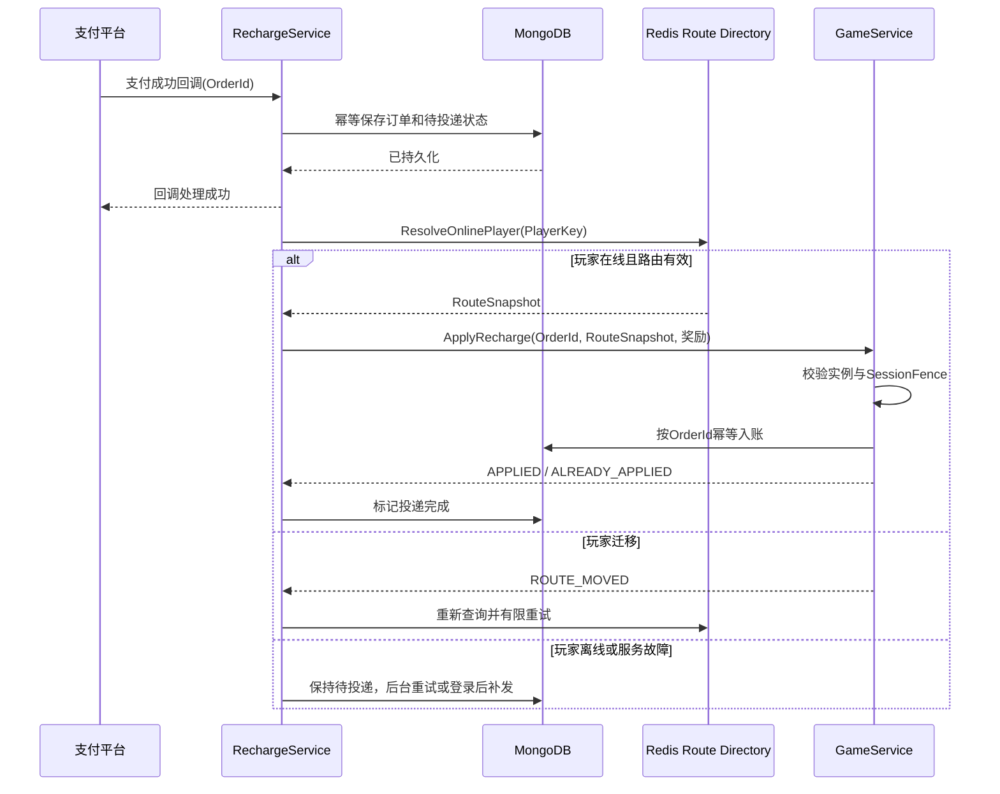

# OriginGame v3 在线玩家路由设计

> 状态：跨服务基础设计稿
> 更新日期：2026-08-13

## 1. 目标与边界

本设计解决以下问题：

1. 同一玩家不能同时被两个 GameService 实例承载；
2. Gateway 登录时可以原子选择负载合适的 GameService；
3. 充值、邮件、GM、聊天等其他后端 Service 可以查询在线玩家当前所在的 GameService；
4. GameService 宕机、重启、Redis 主节点切换和玩家重登时，不把业务通知交给旧会话；
5. 充值等关键业务既能在线实时到账，也不能因即时通知失败而漏发或重复发放。

Redis 是在线协调和路由目录，不是玩家资产、充值订单等持久业务事实的数据库。本设计不重新引入集中式 CenterService，也不建设 SessionService。

## 2. 玩家路由身份

当前 MVP 暂未定义独立角色系统，使用以下二元组作为玩家路由身份：

```text
PlayerKey = RealAreaId + AccountId
```

充值订单和所有面向指定玩家的内部命令必须保存 `RealAreaId` 与 `AccountId`，不能只保存可变昵称。以后支持同账号多角色时，将 `PlayerKey` 的内部实现替换为稳定的 `PlayerId`，对上层查询接口保持不变。

使用真实区服而不是显示区服作为路由维度。合服或展示区调整不能改变已经确定的真实业务归属。

## 3. Redis 路由记录

推荐键名：

```text
{area:<RealAreaId>}:player-route:<AccountId>
```

同一真实区服相关键使用相同 Redis Cluster Hash Tag，为以后切换 Redis Cluster 和执行同槽原子操作保留空间。路由值至少包含：

| 字段 | 说明 |
| --- | --- |
| `real_area_id` | 真实区服 ID |
| `account_id` | 当前 MVP 的账号 ID |
| `state` | `ASSIGNING`、`LOADING`、`ONLINE`、`LEAVING` 或 `ORPHANED` |
| `gs_service` | GameService 逻辑服务名 |
| `gs_instance_id` | GameService 进程本次启动的唯一标识，重启后必须变化 |
| `gs_node_id` | Origin RPC 精确定向调用所需的 NodeId |
| `session_fence` | 此玩家会话单调递增的栅栏值 |
| `gateway_instance_id` | 当前长连接所在 Gateway 实例 |
| `connection_id` | Gateway 实例内连接 ID |
| `updated_at_ms` | 最近一次成功续租时间 |

路由记录必须有租约或 TTL，并由承载玩家的 GameService 使用比较并续租的原子操作刷新。续租时必须同时匹配 `gs_instance_id + session_fence`，旧实例不能覆盖新实例路由。

仅 `ONLINE` 且对应 GameService 实例存活的记录可以向普通调用方返回为在线。`ASSIGNING`、`LOADING`、`LEAVING`、`ORPHANED` 均不得被充值服视作可直接投递目标。

## 4. 统一查询能力

公共库提供统一接口，Gateway 和其他 Service 使用同一实现。该实现通过 DBService RPC 访问 Redis，不直接创建 Redis Client 或连接池：

```text
ResolveOnlinePlayer(ctx, PlayerKey) -> RouteSnapshot | OFFLINE | TEMPORARILY_UNAVAILABLE
```

`RouteSnapshot` 至少返回：

```text
RealAreaId
AccountId
GameServiceName
GameServiceNodeId
GameServiceInstanceId
SessionFence
```

实现规则：

- 通过 DBService 查询 Redis 当前主节点，不从可能延迟的只读副本判断在线归属；
- Resolver 同时检查路由状态、租约和 GameService 存活标识；
- 调用方不得长期缓存查询结果；每次定向调用都携带完整 `RouteSnapshot`；
- 只有 Gateway 和 GameService 的协调逻辑可以通过 DBService 写在线路由；充值等业务 Service 只能使用查询契约，具体授权方式随 DBService RPC 权限和操作限制继续设计；
- `PlayerRouteResolver` 是共享业务能力，不是新的中心服务；它负责路由语义和 DBService 请求构造，Redis Client、连接池和实际命令执行由 DBService 持有。

建议再提供一个公共的“查询并调用”帮助器：

```text
RouteAndCall(ctx, PlayerKey, method, request)
```

它负责查询、精确 NodeId RPC、处理 `ROUTE_MOVED` 后重新查询并进行有限次数重试，避免每个业务 Service 重复实现易出错的竞态处理。

## 5. 路由栅栏与迁移竞态

仅执行“先查 Redis，再向查询结果发 RPC”是不安全的。查询完成后玩家可能已经在另一个 GameService 重登或迁移。

每条定向玩家命令必须携带：

```text
AccountId
RealAreaId
TargetGameServiceInstanceId
SessionFence
BusinessRequestId
```

目标 GameService 收到命令后必须用本地玩家会话校验 `GameServiceInstanceId + SessionFence`：

- 一致：当前实例拥有该玩家，可以处理；
- 玩家不在本实例：返回 `PLAYER_OFFLINE`；
- 玩家存在但栅栏不一致：返回 `ROUTE_MOVED`，不能处理；
- 实例正在退出或恢复：返回 `SERVICE_NOT_READY`。

调用方收到 `ROUTE_MOVED` 后丢弃旧快照，重新查询 Redis 再重试。栅栏校验是正确性条件，不能因为 Redis 查询结果看起来仍然有效而省略。

## 6. GameService 宕机与重启

`gs_instance_id` 必须是进程每次启动生成的新值，不能只使用长期不变的服务名或机器 NodeId。

GameService 启动和恢复遵守以下规则：

1. 完成配置、所需 DBService RPC、服务发现和本地组件初始化前不进入 Ready；GameService 不直接组合 MongoDB 或 Redis Module；
2. 向 Redis 注册新的实例启动标识和带租约的存活记录；
3. 清理或接管旧路由只能通过校验旧实例租约、状态和栅栏的 Redis 原子操作完成；
4. 旧实例遗留玩家路由先转为 `ORPHANED` 或等待租约失效，不能直接当作在线；
5. 恢复完成并能安全承载新玩家后才开放新分配；
6. GameService 必须定期校验自己仍拥有玩家路由；续租或所有权校验持续失败时，应停止处理该玩家的新写命令并执行下线或恢复流程。

GameService 不需要在重启后伪造“之前玩家仍在线”。客户端重连成功、玩家数据重新加载并完成路由认领后，路由才重新变为 `ONLINE`。

## 7. Redis 主节点切换时暂停新分配

公共 `RouteStore` 维护 `OPEN`、`PAUSED`、`RECOVERING` 三态，并通过 DBService RPC 执行全部 Redis 操作。Gateway 只有在 `OPEN` 时才能执行新玩家分配：

1. DBService 报告 Redis 连接断开、写超时、`READONLY`、主节点拓扑变化或原子操作无法确认时，立即进入 `PAUSED`；
2. `PAUSED` 期间已有连接可以继续处理不依赖新路由分配的业务，新登录返回“服务暂时不可用”，不得绕过 Redis 在本地选择 GameService；
3. DBService 连接到新主节点并通过写入能力、原子 Function 版本和复制确认探测后，RouteStore 进入 `RECOVERING`；
4. GameService 重新发布实例存活信息，并对本地在线玩家执行带旧栅栏的路由续租或冲突检查；
5. 恢复窗口结束、旧实例租约已失效或完成核对后，RouteStore 才回到 `OPEN`。

生产 Redis 至少使用一个主节点、两个副本和三个 Sentinel，并配置 `min-replicas-to-write`、`min-replicas-max-lag`。关键路由写入在返回成功前应要求副本确认；无法获得确认时按失败处理并保持暂停。该方案降低异步复制下已确认写丢失的风险，但业务层仍必须依赖 `gs_instance_id + session_fence` 防止旧所有者继续写入。

## 8. 充值实时到账流程



必须遵守：

- 支付回调先验签，再用支付平台订单号或内部 `OrderId` 建立唯一约束；
- 向支付平台确认成功的条件是订单已经可靠持久化，不等待玩家在线 RPC 成功；
- 在线玩家通过精确定向 RPC 获得低延迟通知；RPC 超时不能推断未处理，必须使用同一 `OrderId` 重试；
- GameService 的入账与“此订单已处理”记录必须在同一个持久化原子边界内完成；
- 玩家离线时订单保持待投递。下次登录完成后主动拉取或触发补发，不能丢弃；
- Redis 无路由、路由过期和 GameService 不可用只影响实时性，不影响最终到账；
- 客户端到账提示应由 GameService 在持久化成功后推送，不能由充值服直接向 Gateway 伪造玩家状态变更。

## 9. NATS 使用边界

当前 Docker Compose 启用的是 Core NATS。Origin RPC 可以使用它完成在线快速调用，但 Core NATS 不持久化没有活跃订阅者时的消息，因此充值到账不能只执行一次无回复通知。

MVP 可以使用“MongoDB 待投递订单 + 立即 RPC + 后台重试”实现可靠实时到账。以后需要更高吞吐、消费确认和可回放事件流时，可以启用 JetStream，并使用至少一次投递；即使启用 JetStream，`OrderId` 幂等和 MongoDB 业务事实仍然不能删除。

是否在第一版就启用 JetStream，留到 RechargeService 设计时结合吞吐、MongoDB 部署模式和运维复杂度确认。

## 10. 后续具体设计项

- GameService 负载指标、候选集、容量阈值和原子分配 Function；
- 路由 TTL、续租周期、暂停与恢复窗口的默认数值；
- Redis Sentinel 生产部署与客户端事件接口；
- GameService 玩家数据模型及充值入账的原子持久化方式；
- RechargeService 的订单状态机、重试退避、死信和人工补单流程；
- 是否启用 JetStream 及其 Stream、Consumer、去重窗口和副本配置。
