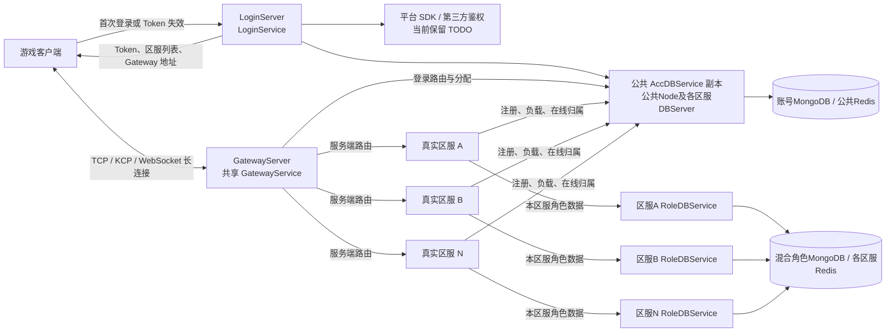

# OriginGame v3 总体架构设计

> 状态：当前阶段架构决策收口稿
> 更新日期：2026-08-22

## 1. 文档目的

本文档只描述 OriginGame v3 的总体结构、服务边界和跨服务公共规则。各 Service 的数据结构、协议、状态机和实现前待讨论项分别维护在对应 Service 设计文档中，避免总体设计持续膨胀。

OriginGame v3 基于 Origin v3 重新构建，老版本 `origingame` 用于理解现有业务划分、登录流程、区服模型和运行方式。新版本参考老版本但不直接照搬具体代码。

当前目标是构建最小可用的游戏服务器架构，不提前引入现阶段不需要的复杂部署模型。

## 2. 设计文档导航

| 文档 | 内容 |
| --- | --- |
| 本文档 | 总体拓扑、全局规则、MVP 范围和跨服务决策 |
| [DBService 设计](services/DBService设计.md) | 集中 MongoDB/Redis 访问、模板实例、按 Key 有序执行和有界并发 |
| [LoginService 设计](services/LoginService设计.md) | HTTP 登录、SDK 鉴权扩展、Token、MongoDB 基础表和区服列表 |
| [GatewayService 设计](services/GatewayService设计.md) | TCP/KCP/WebSocket 接入、Token 验证、登录状态机和客户端消息协议 |
| [GameService 设计](services/GameService设计.md) | PlayerModule、Player、功能 Proxy、数据加载和在线生命周期 |
| [RobotService 设计](services/RobotService设计.md) | 隔离测试环境中的轻量虚拟玩家、OriginBlueprint 行为图和负载生成 |
| [在线玩家归属设计](在线玩家归属设计.md) | Redis 在线归属、GameService 唯一承载和登录原子分配 |
| [登录链路监控与测试设计](登录链路监控与测试设计.md) | LoginService、Gateway、GameService与在线归属的业务监控、慢处理和端到端验收 |
| [部署标识与服务发现配置设计](部署标识与服务发现配置设计.md) | NodeID、Node Labels、实际 ServiceName、发现范围和配置归属 |
| [错误码设计](protocols/错误码设计.md) | HTTP 与长连接协议共用的 Protobuf 错误码 |
| [客户端协议与生成设计](protocols/客户端协议与生成设计.md) | 客户端 Protobuf 目录、兼容规则和生成流程 |
| [RPC 契约与生成设计](protocols/RPC契约与生成设计.md) | Origin RPC 接口、参数、生成物和依赖边界 |
| [本地基础环境](../../deploy/compose/README.md) | Docker Compose 启动可选 etcd/NATS、Redis、MongoDB，并初始化三张基础表和体验区服数据 |

后续新增 Service 时，在 `docs/design/services/` 下创建独立设计文档，并在本节补充索引。

## 3. 当前总体架构

总体分层：

- LoginService 负责 HTTP 登录、平台身份验证扩展、账号处理、Token 签发和区服列表返回。
- DBService 业务无关地集中代理 MongoDB 和 Redis，控制连接池、数据请求容量和按 Key 有序执行。
- GatewayService 负责客户端长连接、Token 验证、连接与会话管理、消息路由和转发。
- 区服业务服务负责玩家状态和本区游戏逻辑。
- 账号数据与区服游戏数据保持职责分离。
- 公共 AccDBService 承载账号与登录协调数据；每个区服使用自己的 RoleDBService 隔离角色数据请求和区服 Redis。
- 显示区服与真实区服映射继续保留，以支持合服和区服展示调整。

## 4. 入口服务命名

| 部署程序 | Origin Service | Go 包 | 核心职责 |
| --- | --- | --- | --- |
| `LoginServer` | `LoginService` | `loginservice` | HTTP 登录、账号、Token 和区服列表 |
| `GatewayServer` | `GatewayService` | `gatewayservice` | TCP、KCP、WebSocket 长连接和后端路由 |

不再沿用老版本 `HttpGateService` 和 `GateService` 的命名。

## 5. 已确认的跨服务决策

### 5.1 登录与 Token

- HTTP登录请求首期只保留`PlatType`、`PlatId`和`AccessToken`。
- 平台 SDK 鉴权保留可替换接口和 `TODO`。
- LoginService 登录成功后签发一定有效期的游戏 Token。
- Token 有效期内客户端直接连接 Gateway，不重复进行 HTTP 和平台 SDK 鉴权。
- Token 采用 Ed25519 签名 JWT，客户端只接收和回传一条 Token 字符串。
- Gateway 使用公钥本地验签，不在连接时访问 MongoDB 或回调 LoginService。

Token 的字段和验证契约见 [LoginService 设计](services/LoginService设计.md#5-token-契约)，Gateway 验签规则见 [GatewayService 设计](services/GatewayService设计.md#5-token-验证)。

### 5.2 集中数据访问与区服信息

- 基础数据库采用 MongoDB。
- 当前基础表固定为 `Account`、`RealAreaInfo` 和 `ShowAreaInfo`。
- 保留 `ShowAreaInfo -> RealAreaInfo -> GateList` 关系。
- Gateway 公网地址存储在 MongoDB `RealAreaInfo.GateList`。
- Gateway 公网地址与 GatewayServer 本地监听地址分离管理。
- 只有 DBService 直接组合 MongoDB 和 Redis Module；LoginService、GatewayService、GameService 和其他业务 Service 均通过 DBService RPC 使用数据能力。
- DBService 使用一个业务无关模板，并按固定数据库实例化为 AccDBService、RoleDBService 等实际服务；所有 Redis 操作同样经过对应 DBService。
- AccDBService 是公共账号和登录协调数据域。公共数据 Node 部署 AccDBService，每个区服 DBServer 也部署一个 AccDBService；这些实例连接同一账号数据库和公共 Redis。
- 每个区服 DBServer 还部署本区服独立的 RoleDBService。GameService 通过本区服 DBServer 上的 AccDBService 实例访问公共账号数据域，完成实例注册、负载、在线归属和登录协调；通过同一部署范围的 RoleDBService 访问角色 MongoDB 与区服 Redis。
- 全部区服角色文档当前混合存放在同一个角色数据库，并以 `ShowAreaID` 显式隔离；RoleDBService 仍按区服分别部署，以隔离队列、并发、连接池、Redis、过载和发布故障。
- Gateway 的 `playerownership.PlayerOwnershipStore` 只调用 AccDBService，不调用任何区服 RoleDBService；它是普通进程内组件，不是 Module 或独立 Service。
- 业务 Service 的 Repository 构造 BSON、Redis Key 和操作参数，DBService 不增加玩家、账号等领域接口，也不管理业务版本和迁移一致性。

集中访问、实例路由、同 Key 顺序和有界执行模型见 [DBService 设计](services/DBService设计.md)；账号与区服表见 [LoginService 设计](services/LoginService设计.md#6-数据访问设计)。

### 5.3 共享 Gateway

- 所有区服共用一个逻辑 Gateway 集群。
- 当前不做 Gateway Cell 化，以后出现容量或故障隔离需求时再扩展。
- GatewayService按配置启用TCP、KCP和WebSocket中的一种或多种协议，全部端点共用业务处理逻辑。
- 客户端保持一条游戏长连接，首期只绑定一个承载Player的GameService。
- Gateway 不承担玩家持久状态和具体游戏业务。

连接登录、消息格式和三协议细节见 [GatewayService 设计](services/GatewayService设计.md)。

### 5.4 登录玩家归属

- 不建设集中式 CenterService 或 SessionService 保存玩家归属；Redis 保存权威在线玩家归属和 GameService 负载协调状态。
- GameService 通过本区服 AccDBService 实例向公共 Redis 注册实例身份、Ready状态、容量、当前负载和带 TTL 的存活租约；该注册表只作为登录原子分配的候选集，不作为普通业务 Service 的公共查询接口。
- Gateway 通过 AccDBService 执行登记的 Redis Script，在同一次原子操作中查询已有玩家归属；没有有效归属时选择并预占当前 `Loading + Online + Resident` 最小且未满的 GameService。
- 当前玩家稳定身份固定为 `PlayerKey = AccountID + ShowAreaID`。`RealAreaID` 只用于当前运行归属、候选 GameService 分组和 Redis Hash Tag，显示区服映射变化不得改变玩家身份。
- 首期不支持在线变更`ShowAreaID -> RealAreaID`映射。调整前必须停止对应显示区服登录并排空Player及旧归属。
- 归属结果必须包含GameService的`NodeID + NodeSessionID`。目标GameService校验当前进程身份和本地Player是否存在，防止Node重启后把旧归属交给新进程；首期没有在线玩家跨GameService迁移，不增加玩家级`SessionFence`或`OwnershipVersion`。
- Gateway长连接使用跨全部Gateway节点、网络Module和进程重启全局唯一的字符串`GatewayConnectionID`。同一玩家的新连接仍进入当前GameService，由GameService通知旧Gateway发送顶号错误并断开旧连接，再绑定新连接；旧连接的迟到消息按连接ID拒绝。
- GameService 正常停止时先进入 `DRAINING` 并从 Redis 候选集摘除；异常退出依赖实例租约到期被分配 Script 跳过。Gateway 对确定未执行、`SERVICE_NOT_READY`、`SERVICE_DRAINING` 等失败最多重试三个不同实例；RPC 超时等状态未知结果必须先查询归属，不能立即分配第二个所有者。
键结构、状态转换和归属竞态见[在线玩家归属设计](在线玩家归属设计.md)。

### 5.5 部署标识与服务发现

- 当前工程使用 Origin 内置 `DiscoveryService` 提供服务发现，服务间 RPC 统一使用 Origin TCP；etcd 和 NATS 不参与当前运行链路。仅 `test-robot-1` 是纯客户端隔离 Node，显式配置 `discovery_enabled: false`，不加入服务发现且只通过 Login HTTP、Gateway TCP 等外部入口访问被测服务。
- NodeID 使用小写 kebab-case：非区服 Node 为 `<scope>-<kind>-<ordinal>`，区服 Node 为 `area<real-area-id>-<kind>-<ordinal>`；范围必须位于第一段，NodeID 只作为稳定实例身份，不作为业务路由解析源。
- 实际 ServiceName 表达能力或数据域，Node Labels 表达部署范围。首期固定 `scope=pub|area`，区服 Node 额外携带字符串 `real_area_id`。
- 同类 Service 在不同 Node 上保持相同实际名称；DBService 模板固定实例化为 `AccDBService` 和 `RoleDBService`，不把区服号或副本号编码进 ServiceName。
- 需要面向全部区服工作的公共Service可以发现全部`scope=area`的GameService；首期登录链路只使用Redis返回的精确NodeID配合`OnNode`。
- 公共调用方默认使用公共 AccDBService，GameService 默认使用本区服 AccDBService 和 RoleDBService，不自动跨部署范围回退。

完整命名、装配矩阵、发现配置和配置文件归属见[部署标识与服务发现配置设计](部署标识与服务发现配置设计.md)。

## 6. Service 启动与 Ready 规则

所有 OriginGame Service 必须遵守“先完成必需准备，再对外提供服务”的统一规则。进程已经启动不等于 Service 已经就绪。

每个 Service 必须明确自己的必需启动依赖和必需预加载数据，并按以下顺序启动：

1. 解析并校验配置；
2. 初始化必需 Module 和内部组件；
3. 连接自身拥有的基础设施、所需 DBService RPC、服务发现或其他必需依赖，并完成可用性检查；
4. 查询并准备运行所需的必需数据；
5. 校验数据完整性，生成可供请求安全读取的初始内存状态；
6. 全部成功后才进入 Ready，并开放外部监听、注册可用服务或接收业务请求。

任何必需步骤失败时，不允许以空数据、默认假数据或半初始化状态对外服务。失败后的重试、退出和告警策略由各 Service 的具体设计确定，但不能绕过 Ready 条件。

Service 进入 Ready 后，如果后台数据刷新失败，可以继续使用最后一次完整且有效的数据快照，同时记录错误和健康状态；不得用失败或不完整的结果覆盖当前快照。

LoginService 和 GatewayService 的具体 Ready 条件分别记录在各自设计文档中。

### 6.1 启动与停止日志

生命周期日志用于让运维直接判断当前启动停在何处，按以下级别输出：

- `Info`：Application 的启动、运行、停止和停止完成；每个 Node 的启动、Ready、停止和停止完成；每个本地 Service 的初始化、启动和停止阶段。Node 启动与 Ready 日志必须包含本次 `node_session_id` 和完整 `local_services` 摘要（实际 ServiceName、模板名和私有标记）；
- `Debug`：服务发现目录快照、发现新增/状态变化/失去，以及其他高频诊断细节。它只输出当前 Node 按 `allow_discovery` 可见的实例；正常 TCP、KCP、WebSocket 单连接的建立和关闭不输出日志，避免高并发时淹没生命周期状态；
- `Warn`/`Error`：可恢复基础设施重试、生命周期失败和资源清理失败。错误日志必须包含 Node、实际 ServiceName 和稳定阶段，但不得输出连接串、密码、Token、原始请求或玩家隐私数据。

`node ready` 表示该 Node 的全部本地 Service 已完成必需准备并可接收业务；单个 `service started` 只表示其自身启动回调已完成，不能替代 Node 整体 Ready。

最终程序入口固定使用 Gin release mode，第三方路由注册提示不得直接写入控制台；HTTP 服务错误仍由 Origin 结构化日志输出。

## 7. 服务器更新原则

热更新按变更类型分别处理，不采用单一技术覆盖所有更新场景。

### 7.1 Go 服务程序

Go 服务程序以新旧实例替换、滚动发布或灰度切换为主要方案，不依赖进程内二进制补丁或 Go Plugin 替换线上核心逻辑。

业务服务更新时，优先使用 Origin v3 的服务生命周期、退役和恢复能力：旧实例停止接收新的业务分配，存量业务完成、迁移或持久化后退出，由新实例接管。

### 7.2 Gateway

Gateway 持有客户端长连接，更新时采用停止接入、连接排空、必要时快速重连其他实例的方式。共享 Gateway 解决后端路由变化时客户端不需要换连接，不承诺 Gateway 实例升级或故障时连接永不中断。

## 8. 最小可用架构范围

当前最小可用版本要求打通：

1. LoginService 完成基础账号或开发鉴权；
2. 登录成功后签发游戏 Token，并返回基础区服列表和共享 Gateway 地址；
3. 客户端使用 Token 通过 TCP、KCP 或 WebSocket 连接 Gateway；
4. Gateway 验证 Token，并将客户端路由到对应真实区服的游戏服务；
5. 游戏服务完成玩家登录、最小玩家数据加载、基础消息处理和退出保存；
6. 客户端断开后Player在原GameService驻留15分钟，支持快速重连并在到期后存档释放。

跨服战斗、复杂场景迁移、Cell化和在线热迁移不属于当前版本。

## 9. 尚未进入具体 Service 设计的问题

以下问题暂不阻塞 LoginService 和 GatewayService 的当前设计：

- 区服内部具体服务的保留、合并、拆分和命名；
- Token 主动撤销、续期和独立重连 Token；
- Cell化和在线热迁移。

具体 Service 被正式讨论时，再建立对应独立设计文档。
