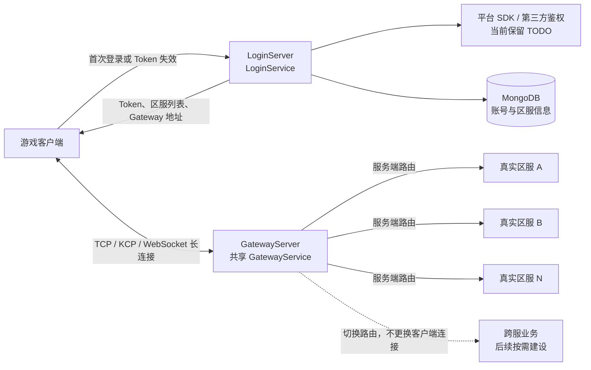

# OriginGame v3 总体架构设计

> 状态：当前阶段架构决策收口稿
> 更新日期：2026-08-12

## 1. 文档目的

本文档只描述 OriginGame v3 的总体结构、服务边界和跨服务公共规则。各 Service 的数据结构、协议、状态机和实现前待讨论项分别维护在对应 Service 设计文档中，避免总体设计持续膨胀。

OriginGame v3 基于 Origin v3 重新构建，老版本 `origingame` 用于理解现有业务划分、登录流程、区服模型和运行方式。新版本参考老版本但不直接照搬具体代码。

当前目标是构建最小可用的游戏服务器架构，不提前引入现阶段不需要的复杂部署模型。

## 2. 设计文档导航

| 文档 | 内容 |
| --- | --- |
| 本文档 | 总体拓扑、全局规则、MVP 范围和跨服务决策 |
| [LoginService 设计](services/LoginService设计.md) | HTTP 登录、SDK 鉴权扩展、Token、MongoDB 基础表和区服列表 |
| [GatewayService 设计](services/GatewayService设计.md) | TCP/KCP/WebSocket 接入、Token 验证、登录状态机和客户端消息协议 |
| [在线玩家路由设计](在线玩家路由设计.md) | Redis 在线归属、GameService 唯一承载、跨服务查询和可靠业务通知 |
| [错误码设计](protocols/错误码设计.md) | HTTP 与长连接协议共用的 Protobuf 错误码 |
| [客户端协议与生成设计](protocols/客户端协议与生成设计.md) | 客户端 Protobuf 目录、兼容规则和生成流程 |
| [RPC 契约与生成设计](protocols/RPC契约与生成设计.md) | Origin RPC 接口、参数、生成物和依赖边界 |
| [本地基础环境](../../deploy/compose/README.md) | Docker Compose 启动 etcd、NATS、Redis、MongoDB，并初始化三张基础表和体验区服数据 |

后续新增 Service 时，在 `docs/design/services/` 下创建独立设计文档，并在本节补充索引。

## 3. 当前总体架构

总体分层：

- LoginService 负责 HTTP 登录、平台身份验证扩展、账号处理、Token 签发和区服列表返回。
- GatewayService 负责客户端长连接、Token 验证、连接与会话管理、消息路由和转发。
- 区服业务服务负责玩家状态和本区游戏逻辑。
- 账号数据与区服游戏数据保持职责分离。
- 显示区服与真实区服映射继续保留，以支持合服和区服展示调整。
- 跨服业务以后按需建设，但 Gateway 路由设计需要为不切换客户端长连接保留扩展能力。

## 4. 入口服务命名

| 部署程序 | Origin Service | Go 包 | 核心职责 |
| --- | --- | --- | --- |
| `LoginServer` | `LoginService` | `loginservice` | HTTP 登录、账号、Token 和区服列表 |
| `GatewayServer` | `GatewayService` | `gatewayservice` | TCP、KCP、WebSocket 长连接和后端路由 |

不再沿用老版本 `HttpGateService` 和 `GateService` 的命名。

## 5. 已确认的跨服务决策

### 5.1 登录与 Token

- HTTP 登录请求参照老版本 `LoginInfo`，当前不额外扩展客户端字段。
- 平台 SDK 鉴权保留可替换接口和 `TODO`。
- LoginService 登录成功后签发一定有效期的游戏 Token。
- Token 有效期内客户端直接连接 Gateway，不重复进行 HTTP 和平台 SDK 鉴权。
- Token 采用 Ed25519 签名 JWT，客户端只接收和回传一条 Token 字符串。
- Gateway 使用公钥本地验签，不在连接时访问 MongoDB 或回调 LoginService。

Token 的字段和验证契约见 [LoginService 设计](services/LoginService设计.md#5-token-契约)，Gateway 验签规则见 [GatewayService 设计](services/GatewayService设计.md#5-token-验证)。

### 5.2 MongoDB 与区服信息

- 基础数据库采用 MongoDB。
- 当前基础表固定为 `Account`、`RealAreaInfo` 和 `ShowAreaInfo`。
- 保留 `ShowAreaInfo -> RealAreaInfo -> GateList` 关系。
- Gateway 公网地址存储在 MongoDB `RealAreaInfo.GateList`。
- Gateway 公网地址与 GatewayServer 本地监听地址分离管理。
- LoginService 直接组合 Origin v3 MongoDB Module，不建设通用 CRUD RPC DBService。

具体数据访问和基础表设计见 [LoginService 设计](services/LoginService设计.md#6-mongodb-访问设计)。

### 5.3 共享 Gateway

- 所有区服共用一个逻辑 Gateway 集群。
- 当前不做 Gateway Cell 化，以后出现容量或故障隔离需求时再扩展。
- 一个 GatewayService 实例同时监听 TCP、KCP 和 WebSocket。
- 客户端保持一条游戏长连接，后续跨服优先通过服务端切换后端路由实现。
- Gateway 不承担玩家持久状态和具体游戏业务。

连接登录、消息格式和三协议细节见 [GatewayService 设计](services/GatewayService设计.md)。

### 5.4 在线玩家路由是跨服务公共能力

- 不建设集中式 CenterService 或 SessionService 保存玩家归属；Redis 保存权威在线玩家路由和 GameService 负载协调状态。
- 在线路由不能只供 Gateway 登录使用。充值、邮件、GM、聊天等任何授权后端 Service 都必须能通过统一的 `PlayerRouteResolver` 查询玩家当前所在的精确 GameService 实例。
- 当前 MVP 使用 `RealAreaId + AccountId` 作为玩家路由身份；以后支持一账号多角色时，统一替换为稳定的 `PlayerId`，不能使用昵称等可变字段。
- 路由结果必须包含 GameService 实例启动标识和单调递增的会话栅栏值。调用方查询后发起 RPC 时携带该路由快照，目标 GameService 必须校验，防止玩家迁移或重登期间把业务交给旧实例。
- Redis 路由只回答“此刻应尝试通知哪个实例”，不能作为充值、发奖等业务事实的唯一存储。关键业务必须先持久化、按业务单号幂等，再尝试在线实时通知；玩家离线、路由变化或目标实例故障时进入可重试的待投递状态。
- 当前 Core NATS RPC 可作为在线通知的低延迟快速路径，但不作为金融类消息的唯一可靠队列。

键结构、查询契约、路由竞态和充值通知流程见 [在线玩家路由设计](在线玩家路由设计.md)。

## 6. Service 启动与 Ready 规则

所有 OriginGame Service 必须遵守“先完成必需准备，再对外提供服务”的统一规则。进程已经启动不等于 Service 已经就绪。

每个 Service 必须明确自己的必需启动依赖和必需预加载数据，并按以下顺序启动：

1. 解析并校验配置；
2. 初始化必需 Module 和内部组件；
3. 连接 MongoDB、服务发现或其他必需依赖，并完成可用性检查；
4. 查询并准备运行所需的必需数据；
5. 校验数据完整性，生成可供请求安全读取的初始内存状态；
6. 全部成功后才进入 Ready，并开放外部监听、注册可用服务或接收业务请求。

任何必需步骤失败时，不允许以空数据、默认假数据或半初始化状态对外服务。失败后的重试、退出和告警策略由各 Service 的具体设计确定，但不能绕过 Ready 条件。

Service 进入 Ready 后，如果后台数据刷新失败，可以继续使用最后一次完整且有效的数据快照，同时记录错误和健康状态；不得用失败或不完整的结果覆盖当前快照。

LoginService 和 GatewayService 的具体 Ready 条件分别记录在各自设计文档中。

## 7. 服务器更新原则

热更新按变更类型分别处理，不采用单一技术覆盖所有更新场景。

### 7.1 Go 服务程序

Go 服务程序以新旧实例替换、滚动发布或灰度切换为主要方案，不依赖进程内二进制补丁或 Go Plugin 替换线上核心逻辑。

业务服务更新时，优先使用 Origin v3 的服务生命周期、退役和恢复能力：旧实例停止接收新的业务分配，存量业务完成、迁移或持久化后退出，由新实例接管。

### 7.2 Gateway

Gateway 持有客户端长连接，更新时采用停止接入、连接排空、必要时快速重连其他实例的方式。共享 Gateway 解决后端路由变化时客户端不需要换连接，不承诺 Gateway 实例升级或故障时连接永不中断。

### 7.3 配置和动态逻辑

- 数值配置采用版本化配置更新，避免同一业务流程混用多个配置版本。
- 已开始的战斗或长流程原则上继续使用启动时确定的配置版本，新流程使用新版本。
- 适合动态化的非核心流程可以使用受控脚本或 OriginBlueprint；核心状态逻辑仍以可发布、可回滚的服务版本为准。

## 8. 最小可用架构范围

当前最小可用版本要求打通：

1. LoginService 完成基础账号或开发鉴权；
2. 登录成功后签发游戏 Token，并返回基础区服列表和共享 Gateway 地址；
3. 客户端使用 Token 通过 TCP、KCP 或 WebSocket 连接 Gateway；
4. Gateway 验证 Token，并将客户端路由到对应真实区服的游戏服务；
5. 游戏服务完成玩家登录、最小玩家数据加载、基础消息处理和退出保存；
6. 客户端断开后能够清理会话，并为后续快速重连保留扩展位置。

跨服战斗、复杂场景迁移、Cell 化和完整在线热迁移不作为当前最小版本的验收条件。

## 9. 尚未进入具体 Service 设计的问题

以下问题暂不阻塞 LoginService 和 GatewayService 的当前设计：

- 区服内部具体服务的保留、合并、拆分和命名；
- GameService 的具体负载指标、权重算法和容量阈值；
- 跨服战斗的状态所有权、路由切换协议和结果回写；
- Token 主动撤销、续期和独立重连 Token；
- 复杂缓存和数据库一致性扩展；
- 配置、脚本和服务版本的完整发布流程；
- Cell 化、完整在线热迁移和完整容量规划。

具体 Service 被正式讨论时，再建立对应独立设计文档。
